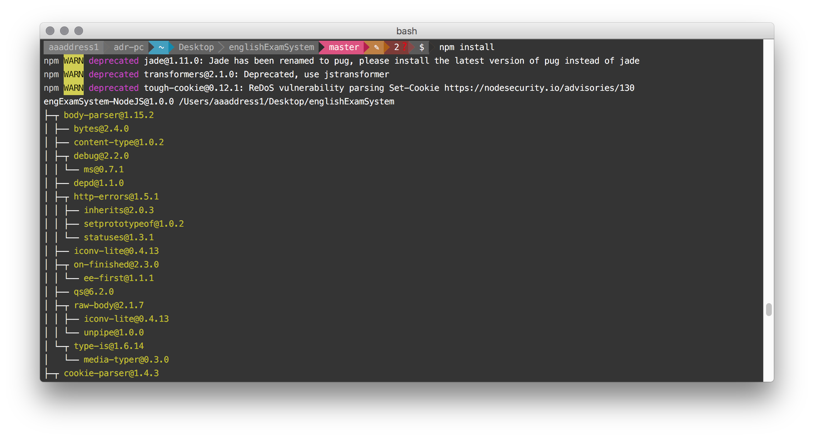
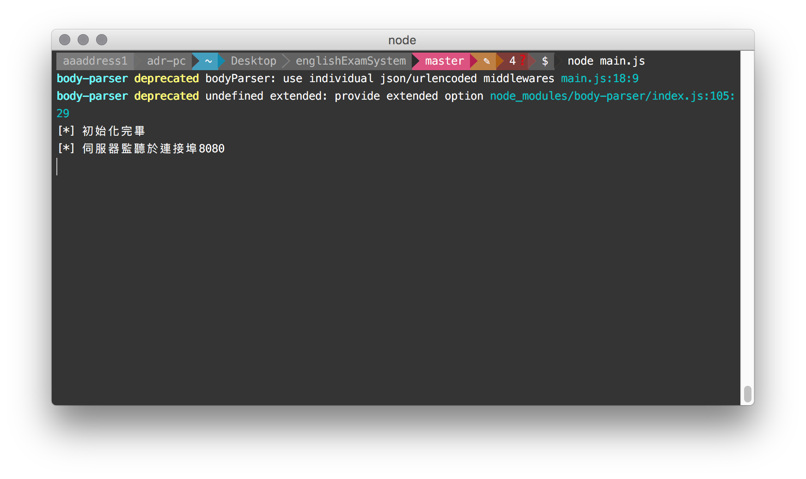

# engExamSystem-NodeJS

##About

基於 Node.js 開發的簡易英文線上填字＋自動批改的系統，允許教師更改測資 [sample.txt](sample.txt)，後端將會自動刪除冠詞並顯示出無冠詞版本作為題目。

題目將會在系統前端 UI 顯示，前端設計上允許使用者在題目上右鍵選單插入定冠詞，並將插入的定冠詞高亮顯示。並可將答案送出後，由後端自動交互比對使用者測資與原答案，自動高亮註記出「多補的冠詞」「缺少補上的冠詞」與「補了且正確的冠詞」。

##Install

在已經有 node 與 npm 的環境下終端機鍵入以下命令，將全自動安裝完成本專案與所有依賴套件包。
`git clone https://github.com/aaaddress1/engExamSystem-NodeJS; cd ./englishExamSystem; npm install;`

##Usage
終端機在本專案目錄下鍵入 `node main.js` 將以 NodeJS 引擎在本地端 8080 port 建立起本英文測驗服務。

##Author
Sheng-Hao Ma, aaaddress1, aka adr. Contact Me: [Facebook](http://fb.com/aaaddress1) or aaaddress1@gmail.com